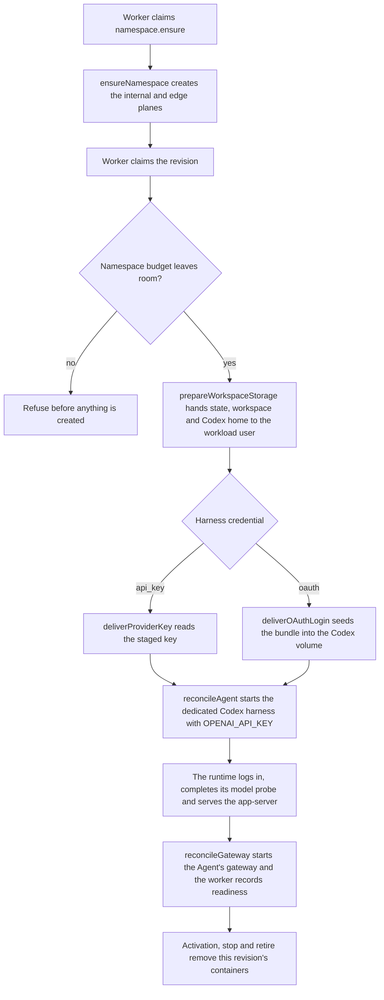

# Rootless containerd compute delivery flow

## Overview

An Installation can place Agents on the operator's own rootless containerd engine instead of a
cluster. This flow starts when composition selects `compute-containerd`, follows a Namespace
reconciliation and an AgentRevision delivery through the Driver and its host helper into the
engine, and stops when the worker records the observation it was given — ready, pending, or a
failure it must not retry.

The Driver owns no engine of its own. It renders options, enforces ownership, and hands one JSON
envelope per operation to a host-side helper that talks to containerd; the engine enforces the
limits in that envelope. Nothing in this path needs Kubernetes, a scheduler, or cluster
credentials.

## Entry Points

- Trigger: a worker claiming a `namespace.ensure` or revision-delivery work item.
- Source: `apps/controller/src/composition/installation-config.ts:784`,
  `apps/controller/src/drivers/compute/containerd/index.ts:270` and `:404`.
- Assumptions: one server-owned Installation, the helper at its configured absolute path, the
  engine running as the operator's rootless containerd, and a runtime image already present in
  the configured containerd namespace.

## Flow

## Execution Trace

### 1. Namespace preparation

`apps/controller/src/drivers/compute/containerd/index.ts:ensureNamespace`

`ensureNamespace` (`index.ts:270`) creates two CNI networks inside the engine's namespace: an
**internal** plane with no connectivity at all and an **edge** plane. Both carry this Driver's
ownership labels, and a plane that already exists is adopted only when its labels match — a
mismatch fails the reconciliation instead of claiming it. A plane that fails halfway is rolled
back under the labels it was created with. `deleteNamespace` (`index.ts:300`) removes containers,
then volumes, then networks, selecting them by label and verifying ownership before each removal,
so a neighbouring Installation's resources are never touched.

### 2. Revision delivery and the credential handoff

`apps/controller/src/drivers/compute/containerd/index.ts:prepareRevision`

`prepareRevision` (`index.ts:404`) decides the tenant budget first
(`admitNamespaceBudget`, `index.ts:1433`): it sums the limits recorded on the Namespace's
containers and refuses a delivery that would exceed `resources.namespace.quota`. Nothing is
created before that decision. It then ensures the Agent's networks and volumes and prepares
storage (`prepareWorkspaceStorage`, `index.ts:922`), which hands the volumes to the workload user
— clearing any earlier Codex login first — and seeds a workspace when the platform sent a request.

A dedicated Codex harness runs a revision-scoped harness container (`reconcileAgent`,
`index.ts:1073`); an embedded OpenClaw Agent runs one gateway container. When the harness
authenticates with the operator's staged Codex login, `deliverOAuthLogin` (`index.ts:1202`) reads
the staged login from the selected Secret Driver's store, reserves it for this exact Agent and
Codex home, and `seedCodexHome` (`index.ts:1240`) runs a one-shot seeder that writes `auth.json`
and the `.oce-oauth.json` receipt into the Agent's own Codex volume (`oauth.ts`). Only then does
the staged login become a consumed marker, so a failed handoff leaves it spendable for a retry;
the gateway never mounts that volume.

When the harness authenticates with a staged provider key instead, `deliverProviderKey`
(`index.ts:1170`) reads the key from the same store under the same ownership proof and hands it to
the harness container as `OPENAI_API_KEY` — the variable the Kubernetes Compute Driver projects —
and to no other container. The harness starts with `CODEX_LOGIN_MODE=api_key`, logs in with
`codex login --with-api-key` from that environment, deletes the variable before serving and runs
its model probe; the gateway receives the transport endpoint and token only. Both deliveries read
the store through `secret-store.ts`, the one place that names its layout.

### 3. Runtime start and readiness

`apps/controller/src/drivers/compute/containerd/index.ts:reconcileAgent`

`reconcileAgent` starts the harness under the repository's tini wrapper with the program split into
bounded pieces (`runtime/node-program.ts`), and waits on the readiness probe the Driver gave the
spec. The helper runs every probe with a fixed minimal environment, so the harness probe is
self-contained (`HARNESS_READINESS_COMMAND`, `spec.ts`) and checks the Codex app-server's own
`http://127.0.0.1:18790/readyz`; the runtime withholds that answer until `codex-login` and a real
model probe have completed.

The gateway (`reconcileGateway`, `index.ts:1333`) is Agent-scoped: it serves whichever revision is
active, so its ownership is proven at Agent scope while its labels record the revision that
created it. Readiness comes from a probe inside the container, and the published loopback port is
read back from the running container, which is what `getGatewayEndpoint` resolves.

### 4. Helper protocol

`apps/controller/src/drivers/compute/containerd/executor.ts:invoke`

Every operation travels as one JSON envelope through `executor.ts:45`, which spawns the helper,
bounds it, and settles once. `helpers/compute-containerd/main.go:26` dispatches on request, on the
rootless parent re-exec, on the OCI hook and on the log shim — the last two being modes nerdctl
normally serves itself, which is why the helper's path must stay stable. The helper reads back the
labels it stored, so ownership is enforced against the engine rather than against the Driver's
memory.

## Debugging and Verification

- A helper that is absent, or an engine that is not rootless, fails preflight and the worker
  records a startup failure rather than delivering.
- A missing runtime image in the configured namespace is reported as a preflight warning, not an
  error, so an operator sees it before a delivery fails.
- `Workspace initialization failed` means the initializer exited non-zero: its ownership handoff
  could not reach a volume, or it could not clear an earlier Codex login.
- The harness publishes `{"event":"runtime.startup_phase","phase":"codex-login"|"model-probe"|
"native-spawn"}` and `{"event":"codex.model_probe","code":"READY"}` on its standard error; a
  failed harness holds that failure instead of serving. Read them with
  `nerdctl -n <namespace> logs <harness>`.
- A workspace that was never seeded leaves the runtime unable to pass its own admission, so the
  readiness window expires and the revision is reported as not ready.
- A budget that leaves no room, a foreign resource, and an unreadable credential are all
  permanent failures: retrying cannot change them.
- Verify the delivery end to end with
  `OCC_TEST_NERDCTL_REAL=1 node --test tests/integration/containerd-compute-real.test.mjs`, and the
  platform path (including a real provider-key model turn) with the
  `postgres-application` lane and `OCC_TEST_NERDCTL_REAL=1 OPENAI_API_KEY=… OCC_TEST_OPENAI_MODEL=…`
  on `tests/integration/containerd-compute-workflow.test.mjs`.

## Related docs

- [Rootless containerd Compute Driver](../reference/drivers/containerd-compute.md)
- [Rootless containerd testing](../testing/containerd.md)
- [Compute Driver lifecycle hooks](compute-driver-lifecycle-hooks.md)
- [Local rootless containerd deployment](../guides/deploy/local-containerd-development.md)

## Manual Notes

[keep this for the user to add notes. do not change between edits]

## Changelog

- 2026-10-09 23:55: Cut the paired-SandboxDriver delegation, and documented the staged provider-key delivery, the self-contained harness readiness probe and the initializer's login-clearing order. (containerd-driver-finisher - 8643323fe)
